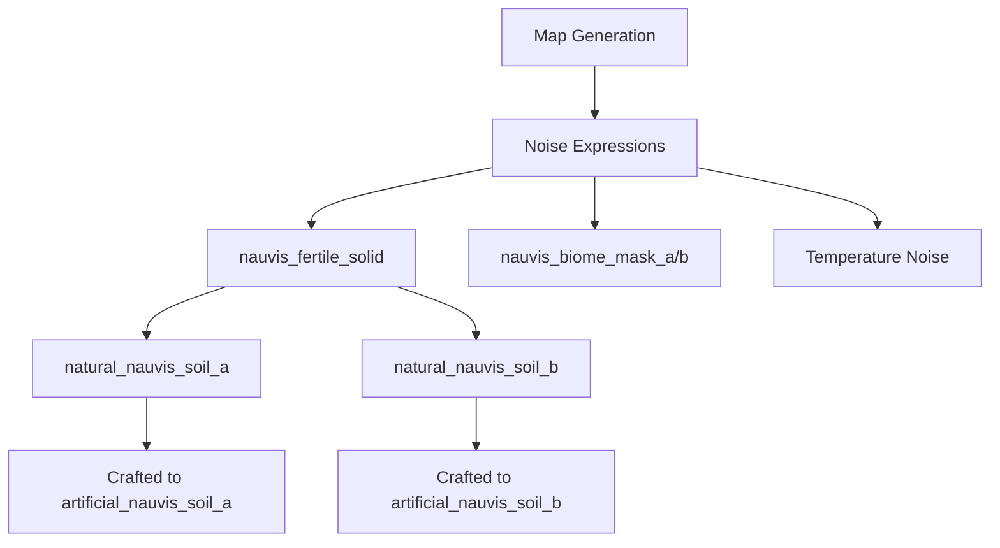

# Implementing Farmable Soil for Nauvis

This guide is based on the space age mod which implements farmable soild for the planet Gleba.

## Overview

Based on the Gleba implementation, farmable soil for Nauvis would consist of:

1. **Natural soil tiles** that generate on the map during world creation
2. **Artificial soil tiles** that can be crafted and placed by players



## Step 1: Define Tile Prototypes

Create new tile definitions for both natural and artificial soil types:

```lua
-- In prototypes/tile/tiles-nauvis.lua

local tile_trigger_effects = require("prototypes.tile.tile-trigger-effects")
local tile_pollution = require("__space-age__/prototypes/tile/tile-pollution-values")
local tile_collision_masks = require("__base__/prototypes/tile/tile-collision-masks")
local tile_graphics = require("__base__/prototypes/tile/tile-graphics")
local base_sounds = require("__base__/prototypes/entity/sounds")
local base_tile_sounds = require("__base__/prototypes/tile/tile-sounds")
local tile_sounds = require("__space-age__/prototypes/tile/tile-sounds")

-- Set a tile offset for Nauvis farmable tiles
nauvis_farmable_tile_offset = 25

data:extend({
  -- Natural Soil A - Appears in warmer regions
  {
    type = "tile",
    name = "natural-nauvis-soil-a",
    order = "d[nauvis]-c[natural-soil-a]",
    subgroup = "nauvis-tiles",
    collision_mask = tile_collision_masks.ground(),
    autoplace = {probability_expression = "nauvis_fertile_solid * 50000 - 40000 - nauvis_biome_mask_a * 1000000"},
    layer_group = "ground-natural",
    layer = nauvis_farmable_tile_offset + 1,
    searchable = true,

    transitions = data.raw["tile"]["grass-1"].transitions,
    transitions_between_transitions = data.raw["tile"]["grass-1"].transitions_between_transitions,
    trigger_effect = tile_trigger_effects.dirt_1_trigger_effect(),

    sprite_usage_surface = "nauvis",
    variants = tile_variations_template_with_transitions(
      "__space-age__/graphics/terrain/natural-nauvis-soil-a.png",
      {
        max_size = 4,
        [1] = { weights = {0.085, 0.085, 0.085, 0.085, 0.087, 0.085, 0.065, 0.085, 0.045, 0.045, 0.045, 0.045, 0.005, 0.025, 0.045, 0.045 } },
        [2] = { probability = 1, weights = {0.018, 0.020, 0.015, 0.025, 0.015, 0.020, 0.025, 0.015, 0.025, 0.025, 0.010, 0.025, 0.020, 0.025, 0.025, 0.010 }, },
        [4] = { probability = 0.1, weights = {0.018, 0.020, 0.015, 0.025, 0.015, 0.020, 0.025, 0.015, 0.025, 0.025, 0.010, 0.025, 0.020, 0.025, 0.025, 0.010 }, },
      }
    ),

    walking_sound = tile_sounds.walking.dirt,
    landing_steps_sound = tile_sounds.landing.dirt,
    build_sound = base_tile_sounds.building.dirt,
    map_color={121, 90, 38},
    scorch_mark_color = {r = 0.329, g = 0.242, b = 0.177, a = 1.000}
  },

  -- Natural Soil B - Appears in cooler regions
  {
    type = "tile",
    name = "natural-nauvis-soil-b",
    order = "e[nauvis]-b[natural-soil-b]",
    subgroup = "nauvis-tiles",
    collision_mask = tile_collision_masks.ground(),
    autoplace = {probability_expression = "nauvis_fertile_solid * 50000 - 40000 - nauvis_biome_mask_b * 1000000"},
    layer_group = "ground-natural",
    layer = nauvis_farmable_tile_offset + 2,
    searchable = true,

    transitions = data.raw["tile"]["grass-1"].transitions,
    transitions_between_transitions = data.raw["tile"]["grass-1"].transitions_between_transitions,
    trigger_effect = tile_trigger_effects.dirt_1_trigger_effect(),

    sprite_usage_surface = "nauvis",
    variants = tile_variations_template_with_transitions(
      "__space-age__/graphics/terrain/natural-nauvis-soil-b.png",
      {
        max_size = 4,
        [1] = { weights = {0.085, 0.085, 0.085, 0.085, 0.087, 0.085, 0.065, 0.085, 0.045, 0.045, 0.045, 0.045, 0.005, 0.025, 0.045, 0.045 } },
        [2] = { probability = 1, weights = {0.018, 0.020, 0.015, 0.025, 0.015, 0.020, 0.025, 0.015, 0.025, 0.025, 0.010, 0.025, 0.020, 0.025, 0.025, 0.010 }, },
        [4] = { probability = 0.1, weights = {0.018, 0.020, 0.015, 0.025, 0.015, 0.020, 0.025, 0.015, 0.025, 0.025, 0.010, 0.025, 0.020, 0.025, 0.025, 0.010 }, },
      }
    ),

    walking_sound = tile_sounds.walking.dirt,
    landing_steps_sound = tile_sounds.landing.dirt,
    build_sound = base_tile_sounds.building.dirt,
    map_color={90, 121, 38},
    scorch_mark_color = {r = 0.329, g = 0.242, b = 0.177, a = 1.000}
  },

  -- Artificial Soil A - Can be crafted and placed
  {
    type = "tile",
    name = "artificial-nauvis-soil-a",
    order = "d[nauvis]-d[artificial-soil-a]",
    subgroup = "nauvis-tiles",
    minable = {mining_time = 0.5, result = "artificial-nauvis-soil-a"},
    mined_sound = base_sounds.deconstruct_bricks(0.8),
    is_foundation = true,
    collision_mask = tile_collision_masks.ground(),
    layer = nauvis_farmable_tile_offset + 3,
    searchable = true,

    transitions = data.raw["tile"]["landfill"].transitions,
    transitions_between_transitions = data.raw["tile"]["landfill"].transitions_between_transitions,
    trigger_effect = tile_trigger_effects.landfill_trigger_effect(),

    sprite_usage_surface = "nauvis",
    variants = tile_variations_template_with_transitions(
      "__space-age__/graphics/terrain/artificial-nauvis-soil-a.png",
      {
        max_size = 4,
        [1] = { weights = {0.085, 0.085, 0.085, 0.085, 0.087, 0.085, 0.065, 0.085, 0.045, 0.045, 0.045, 0.045, 0.005, 0.025, 0.045, 0.045 } },
        [2] = { probability = 1, weights = {0.018, 0.020, 0.015, 0.025, 0.015, 0.020, 0.025, 0.015, 0.025, 0.025, 0.010, 0.025, 0.020, 0.025, 0.025, 0.010 }, },
        [4] = { probability = 0.1, weights = {0.018, 0.020, 0.015, 0.025, 0.015, 0.020, 0.025, 0.015, 0.025, 0.025, 0.010, 0.025, 0.020, 0.025, 0.025, 0.010 }, },
      }
    ),

    walking_sound = tile_sounds.walking.dirt,
    landing_steps_sound = tile_sounds.landing.dirt,
    driving_sound = tile_sounds.driving.dirt,
    build_sound = base_tile_sounds.building.landfill,
    map_color={135, 100, 43},
    scorch_mark_color = {r = 0.329, g = 0.242, b = 0.177, a = 1.000}
  },

  -- Artificial Soil B - Can be crafted and placed
  {
    type = "tile",
    name = "artificial-nauvis-soil-b",
    order = "e[nauvis]-c[artificial-soil-b]",
    subgroup = "nauvis-tiles",
    minable = {mining_time = 0.5, result = "artificial-nauvis-soil-b"},
    mined_sound = base_sounds.deconstruct_bricks(0.8),
    is_foundation = true,
    collision_mask = tile_collision_masks.ground(),
    layer = nauvis_farmable_tile_offset + 4,
    searchable = true,

    transitions = data.raw["tile"]["landfill"].transitions,
    transitions_between_transitions = data.raw["tile"]["landfill"].transitions_between_transitions,
    trigger_effect = tile_trigger_effects.landfill_trigger_effect(),

    sprite_usage_surface = "nauvis",
    variants = tile_variations_template_with_transitions(
      "__space-age__/graphics/terrain/artificial-nauvis-soil-b.png",
      {
        max_size = 4,
        [1] = { weights = {0.085, 0.085, 0.085, 0.085, 0.087, 0.085, 0.065, 0.085, 0.045, 0.045, 0.045, 0.045, 0.005, 0.025, 0.045, 0.045 } },
        [2] = { probability = 1, weights = {0.018, 0.020, 0.015, 0.025, 0.015, 0.020, 0.025, 0.015, 0.025, 0.025, 0.010, 0.025, 0.020, 0.025, 0.025, 0.010 }, },
        [4] = { probability = 0.1, weights = {0.018, 0.020, 0.015, 0.025, 0.015, 0.020, 0.025, 0.015, 0.025, 0.025, 0.010, 0.025, 0.020, 0.025, 0.025, 0.010 }, },
      }
    ),

    walking_sound = tile_sounds.walking.dirt,
    landing_steps_sound = tile_sounds.landing.dirt,
    driving_sound = tile_sounds.driving.dirt,
    build_sound = base_tile_sounds.building.landfill,
    map_color={100, 135, 43},
    scorch_mark_color = {r = 0.329, g = 0.242, b = 0.177, a = 1.000}
  },
})
```

## Step 2: Create Map Generation Noise Expressions

The noise expressions control where and how natural soil generates:

```lua
-- In prototypes/planet/planet-nauvis-map-gen.lua

data:extend{
  -- Function to help with selecting ranges of values
  {
    type = "noise-function",
    name = "nauvis_select",
    parameters = {"input", "from", "to", "slope", "min", "max"},
    expression = "clamp(min(input - (from - slope), to + slope - input) / slope, min, max)"
  },

  -- Noise expression to create wobble for variation
  {
    type = "noise-expression",
    name = "nauvis_wobble_x",
    expression = "multioctave_noise{x = x, y = y, persistence = 0.7, seed0 = map_seed, seed1 = 2000, octaves = 3, input_scale = 1/20}"
  },

  {
    type = "noise-expression",
    name = "nauvis_wobble_y",
    expression = "multioctave_noise{x = x, y = y, persistence = 0.7, seed0 = map_seed, seed1 = 3000, octaves = 3, input_scale = 1/20}"
  },

  -- Noise expression to define fertile spot areas
  {
    type = "noise-expression",
    name = "nauvis_fertile_spots",
    expression = "spot_noise{ x = x + wobble_noise_x * 15,\z
                              y = y + wobble_noise_y * 15,\z
                              seed0 = map_seed,\z
                              seed1 = 1,\z
                              candidate_spot_count = 80,\z
                              suggested_minimum_candidate_point_spacing = 128,\z
                              skip_span = 1,\z
                              skip_offset = 0,\z
                              region_size = 1024,\z
                              density_expression = 80,\z
                              spot_quantity_expression = 1000,\z
                              spot_radius_expression = 32,\z
                              hard_region_target_quantity = 0,\z
                              spot_favorability_expression = 60,\z
                              basement_value = -0.5,\z
                              maximum_spot_basement_radius = 128}",
    local_expressions =
    {
      wobble_noise_x = "multioctave_noise{x = x, y = y, persistence = 0.5, seed0 = map_seed, seed1 = 3000000, octaves = 2, input_scale = 1/20}",
      wobble_noise_y = "multioctave_noise{x = x, y = y, persistence = 0.5, seed0 = map_seed, seed1 = 4000000, octaves = 2, input_scale = 1/20}"
    }
  },

  -- Create coastal spots (optional for Nauvis - could be near water or forests)
  {
    type = "noise-expression",
    name = "nauvis_fertile_spots_coastal",
    expression = "max(min(1, nauvis_starting_fertile * 4),\z
                      min(exclude_middle, nauvis_fertile_spots) - max(0, (distance_to_water - 10) / 5))",
    local_expressions =
    {
      exclude_middle = "(distance / nauvis_starting_area_multiplier / 150) - 2.2",
      distance_to_water = "2 * abs(multioctave_noise{x = x, y = y, persistence = 0.7, seed0 = map_seed, seed1 = 5000000, octaves = 3, input_scale = 1/60})"
    }
  },

  -- Temperature noise used to influence biome mask boundaries
  {
    type = "noise-expression",
    name = "nauvis_temperature",
    expression = "clamp(0.8 * multioctave_noise{x = x + nauvis_wobble_x * 6, y = y + nauvis_wobble_y * 6, persistence = 0.65, octaves = 4, input_scale = 1/4, seed0 = map_seed, seed1 = 18000}, -1, 1)"
  },

  -- Starting area multiplier
  {
    type = "noise-expression",
    name = "nauvis_starting_area_multiplier",
    expression = "1.0"
  },

  -- Define fertile areas based on spots and texture
  {
    type = "noise-expression",
    name = "nauvis_fertile_solid",
    expression = "2 * abs(multioctave_noise{x = x, y = y, persistence = 0.7, seed0 = map_seed, seed1 = 2000000, octaves = 2, input_scale = 1/16})\z
                  * nauvis_fertile_spots_coastal"
  },

  -- Starting area fertile spots
  {
    type = "noise-expression",
    name = "nauvis_starting_fertile",
    expression = "max(starting_soil_a, starting_soil_b)",
    local_expressions =
    {
      starting_soil_a = "starting_spot_at_angle{angle = nauvis_starting_angle + 235,\z
                                                distance = 310 * nauvis_starting_area_multiplier,\z
                                                radius = 40 * nauvis_starting_area_multiplier,\z
                                                x_distortion = nauvis_wobble_x * 15,\z
                                                y_distortion = nauvis_wobble_x * 15}",
      starting_soil_b = "starting_spot_at_angle{angle = nauvis_starting_angle + 65,\z
                                               distance = 310 * nauvis_starting_area_multiplier,\z
                                               radius = 40 * nauvis_starting_area_multiplier,\z
                                               x_distortion = nauvis_wobble_x * 15,\z
                                               y_distortion = nauvis_wobble_x * 15}",
    }
  },

  -- Define starting angle
  {
    type = "noise-expression",
    name = "nauvis_starting_angle",
    expression = "map_seed_normalized * 3600"
  },

  -- Define biome masks to separate different soil types based on temperature
  {
    type = "noise-expression",
    name = "nauvis_biome_mask_a",
    expression = "nauvis_temperature > 0.3"
  },

  {
    type = "noise-expression",
    name = "nauvis_biome_mask_b",
    expression = "nauvis_temperature < 0.7"
  }
}
```

## Step 3: Create Items for Artificial Soil

Define the craftable items for artificial soil:

```lua
-- In prototypes/item.lua

data:extend({
  {
    type = "item",
    name = "artificial-nauvis-soil-a",
    icon = "__space-age__/graphics/icons/artificial-nauvis-soil-a.png",
    icon_size = 64,
    icon_mipmaps = 4,
    subgroup = "terrain",
    order = "c[landfill]-b[artificial-nauvis-soil-a]",
    stack_size = 100,
    place_as_tile =
    {
      result = "artificial-nauvis-soil-a",
      condition_size = 1,
      condition = { "water-tile" }
    }
  },
  {
    type = "item",
    name = "artificial-nauvis-soil-b",
    icon = "__space-age__/graphics/icons/artificial-nauvis-soil-b.png",
    icon_size = 64,
    icon_mipmaps = 4,
    subgroup = "terrain",
    order = "c[landfill]-c[artificial-nauvis-soil-b]",
    stack_size = 100,
    place_as_tile =
    {
      result = "artificial-nauvis-soil-b",
      condition_size = 1,
      condition = { "water-tile" }
    }
  },
})
```

## Step 4: Create Recipes for Artificial Soil

Define recipes to craft artificial soil:

```lua
-- In prototypes/recipe.lua

data:extend({
  {
    type = "recipe",
    name = "artificial-nauvis-soil-a",
    energy_required = 5,
    enabled = false,
    category = "crafting",
    ingredients =
    {
      {"stone", 10},
      {"wood", 5},
      {"water-barrel", 1},
      -- For type A - warm soil, perhaps add something representing warmth
      {"coal", 3}
    },
    result = "artificial-nauvis-soil-a",
    result_count = 1
  },
  {
    type = "recipe",
    name = "artificial-nauvis-soil-b",
    energy_required = 5,
    enabled = false,
    category = "crafting",
    ingredients =
    {
      {"stone", 10},
      {"wood", 5},
      {"water-barrel", 1},
      -- For type B - cold soil, perhaps add something else
      {"iron-ore", 3}
    },
    result = "artificial-nauvis-soil-b",
    result_count = 1
  },
})
```

## Step 5: Add Technology Unlocks

Add technology to unlock farmable soil crafting:

```lua
-- In prototypes/technology.lua

-- Option 1: Add to existing technology
table.insert(data.raw["technology"]["agriculture"].effects,
  { type = "unlock-recipe", recipe = "artificial-nauvis-soil-a" })

table.insert(data.raw["technology"]["agriculture"].effects,
  { type = "unlock-recipe", recipe = "artificial-nauvis-soil-b" })

-- Option 2: Create a new technology specifically for farmable soil
data:extend({
  {
    type = "technology",
    name = "nauvis-soil-engineering",
    icon = "__space-age__/graphics/technology/nauvis-soil-engineering.png",
    icon_size = 256,
    icon_mipmaps = 4,
    prerequisites = {"agriculture"},
    effects =
    {
      {
        type = "unlock-recipe",
        recipe = "artificial-nauvis-soil-a"
      },
      {
        type = "unlock-recipe",
        recipe = "artificial-nauvis-soil-b"
      }
    },
    unit =
    {
      count = 150,
      ingredients =
      {
        {"automation-science-pack", 1},
        {"logistic-science-pack", 1}
      },
      time = 30
    },
    order = "c-a"
  }
})
```

## Step 6: Add Autoplace Controls

Create an autoplace control to allow players to customize the spawn of natural soil:

```lua
-- In prototypes/autoplace-controls.lua

data:extend(
{
  {
    type = "autoplace-control",
    name = "nauvis_fertile_soil",
    richness = true,
    order = "c-z-z",
    category = "terrain",
    can_be_disabled = false
  }
})
```

## Step 7: Add Farming-Related Entities

Create the specific crops that can grow on these soils:

```lua
-- In prototypes/entity/nauvis-crops.lua

data:extend({
  {
    type = "simple-entity",
    name = "nauvis-crop-a",
    icon = "__space-age__/graphics/icons/nauvis-crop-a.png",
    icon_size = 64,
    flags = {"placeable-neutral", "player-creation"},
    minable = {mining_time = 0.5, result = "nauvis-crop-a-item", count = 3},
    max_health = 20,
    corpse = "small-remnants",
    collision_box = {{-0.4, -0.4}, {0.4, 0.4}},
    selection_box = {{-0.5, -0.5}, {0.5, 0.5}},
    drawing_box = {{-0.5, -0.8}, {0.5, 0.5}},
    tile_width = 1,
    tile_height = 1,
    placeable_by = {item = "nauvis-crop-a-seed", count = 1},
    tiles_allowed = {"artificial-nauvis-soil-a", "natural-nauvis-soil-a"},
    pictures =
    {
      {
        filename = "__space-age__/graphics/entity/nauvis-crop-a/nauvis-crop-a-00.png",
        width = 32,
        height = 64,
        scale = 1,
        shift = {0, -1}
      },
      -- Add more growth stages as needed
    }
  },

  {
    type = "simple-entity",
    name = "nauvis-crop-b",
    icon = "__space-age__/graphics/icons/nauvis-crop-b.png",
    icon_size = 64,
    flags = {"placeable-neutral", "player-creation"},
    minable = {mining_time = 0.5, result = "nauvis-crop-b-item", count = 3},
    max_health = 20,
    corpse = "small-remnants",
    collision_box = {{-0.4, -0.4}, {0.4, 0.4}},
    selection_box = {{-0.5, -0.5}, {0.5, 0.5}},
    drawing_box = {{-0.5, -0.8}, {0.5, 0.5}},
    tile_width = 1,
    tile_height = 1,
    placeable_by = {item = "nauvis-crop-b-seed", count = 1},
    tiles_allowed = {"artificial-nauvis-soil-b", "natural-nauvis-soil-b"},
    pictures =
    {
      {
        filename = "__space-age__/graphics/entity/nauvis-crop-b/nauvis-crop-b-00.png",
        width = 32,
        height = 64,
        scale = 1,
        shift = {0, -1}
      },
      -- Add more growth stages as needed
    }
  },
})
```

## Step 8: Integrate Everything

Make sure to require all your new files in the main data files:

```lua
-- In data.lua or data-updates.lua

require("prototypes/tile/tiles-nauvis")
require("prototypes/planet/planet-nauvis-map-gen")
require("prototypes/entity/nauvis-crops")
```

## Technical Explanation of Soil Generation

The soil generation system works through several layers of noise expressions:

1. **Fertile Spots**: Created using `spot_noise` which places distinct spots of potential farmland
2. **Temperature Variation**: Uses octave noise to create temperature variation across the map
3. **Biome Masks**: Separate different soil types based on temperature thresholds
4. **Final Distribution**: Combines all these factors to determine where each soil type appears

The autoplace expression `nauvis_fertile_solid * 50000 - 40000 - nauvis_biome_mask_a * 1000000` works as follows:

- `nauvis_fertile_solid * 50000` creates a base probability map for fertile soil
- `-40000` is a threshold that ensures soil only appears in the most fertile spots
- `-nauvis_biome_mask_a * 1000000` creates a sharp division between biomes, ensuring soil A only appears in warm regions

## Compatibility Notes

This implementation can coexist with vanilla Factorio terrain generation since:

1. It uses unique tile names that won't conflict with vanilla
2. The placement is controlled through custom noise expressions
3. Everything is properly namespaced using the mod's prefix

## Graphics Requirements

You'll need to create the following graphics:
- Tile textures for all four soil types
- Item icons for the craftable soils
- Entity graphics for crops
- Technology icons
